# 業界比較機能 操作マニュアル

このマニュアルは、新しく追加された業界比較機能の操作方法について説明します。本機能は、自社の従業員満足度（ES）データと特定の業界平均データを比較することで、自社の強みや弱みを客観的に把握し、今後の施策立案に役立てることを目的としています。

---

## 前提条件と操作の全体像

### 前提条件

* Googleスプレッドシートへのアクセス権限があること。
* 自動報告書などで既に分析対象企業のデータ活用に慣れていること。

### 操作の3ステップ

業界比較機能を利用するにあたり、大きく3つのステップがあります。

1.  **データダウンロード**: 比較に用いる業界データをダウンロードします。
2.  **ファイル取り込み**: ダウンロードしたデータをGoogleスプレッドシートに取り込みます。
3.  **分析実行**: 取り込んだデータを用いて、実際に比較分析を行います。

---

## 操作手順 1: 業界比較データのダウンロード

### 1-1. 分析対象企業データの確認と業界比較データダウンロードの開始

分析対象企業データは既に活用されているため、今回は業界比較データのダウンロードから開始します。Googleスプレッドシートの「設定シート」を開き、画面を下にスクロールして「業界比較データ」のセクションを探します。

---

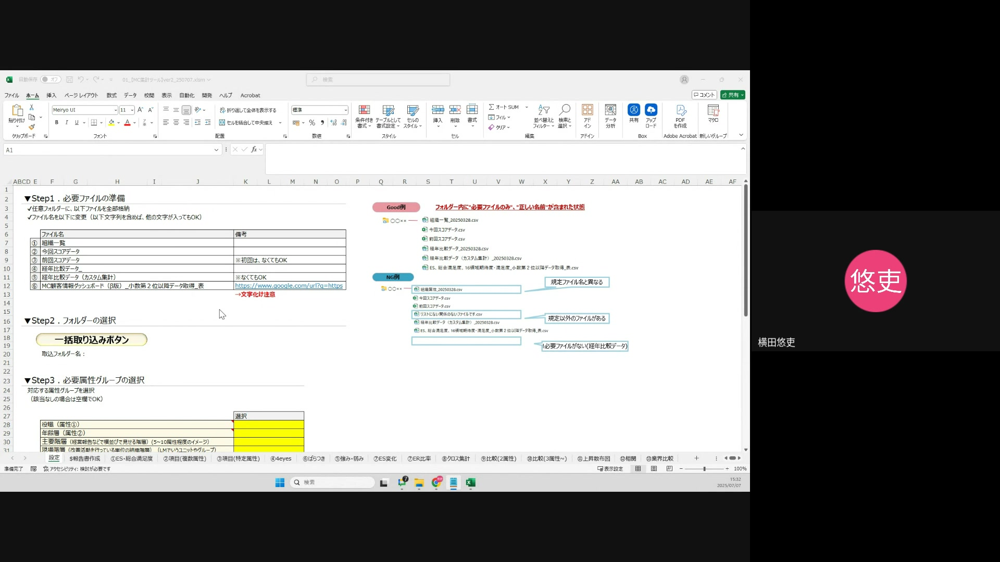

---

## 操作手順 1: 業界比較データのダウンロード

### 1-2. 業界比較データ検索URLへのアクセス

「設定シート」の52行目にある検索URL（`https://lookerstudio.google.com/u/0/reporting/`で始まるURL）をクリックして、業界比較ダッシュボードにアクセスします。このURLからダッシュボードにアクセスすることで、比較したい業界のデータを絞り込むことができます。

---

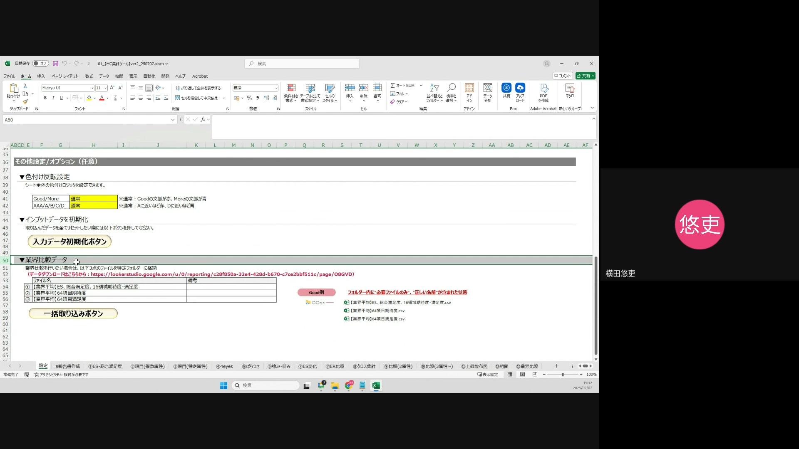

---

## 操作手順 1: 業界比較データのダウンロード

### 1-3. 比較したい業界の選択

開かれた「カスタム業界比較ダッシュボード」画面で、「業界区分」のドロップダウンメニューから比較したい業界を選択します。これにより、選択した業界に特化したデータが表示されます。例えば、建設業界のデータを比較したい場合は「建設」を選択します。

---

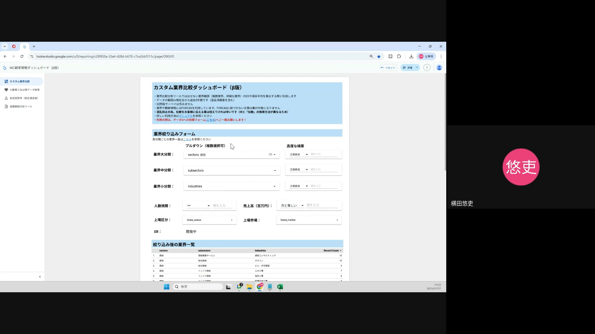

---

## 操作手順 1: 業界比較データのダウンロード

### 1-4. 業界平均データのダウンロード準備

業界を選択した後、画面を下にスクロールします。ダウンロードが必要なファイルは以下の3種類です。

1.  **業界平均ES：** 総合満足度・16領域期待度・満足度データ
2.  **業界平均64項目：** 期待度データ
3.  **業界平均64項目：** 満足度データ

これらのデータをダウンロードすることで、自社データとの比較に必要な業界平均値を準備します。

---

---

## 操作手順 1: 業界比較データのダウンロード

### 1-5. 業界平均ES（総合満足度・16領域期待度・満足度）のダウンロード

1.  **ファイル名コピー**: 最初のファイル「業界平均ES：総合満足度・16領域期待度・満足度データ」のファイル名をコピーします。正確なファイル名で保存するために、この手順は重要です。
2.  **エクスポートボタンクリック**: ファイル名の右側にある「︙」ボタンをクリックし、表示されるメニューから「データをエクスポート」を選択します。

---

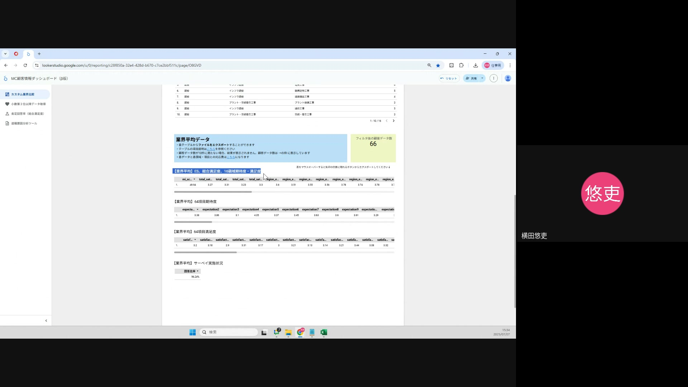

---

## 操作手順 1: 業界比較データのダウンロード

### 1-5. 業界平均ES（総合満足度・16領域期待度・満足度）のダウンロード（続き）

3.  **既存ファイル名削除**: エクスポートダイアログが表示されたら、既存のファイル名を一度削除します。
4.  **ファイル名ペースト**: 先ほどコピーしたファイル名を貼り付けます。
5.  **形式選択**: 「CSV（カンマ区切り）」を選択し、「エクスポート」ボタンをクリックしてダウンロードします。

---

## 操作手順 1: 業界比較データのダウンロード

### 1-6. 業界平均64項目（期待度）のダウンロード

1.  **ファイル名コピー**: 「業界平均64項目：期待度データ」のファイル名をコピーします。
2.  **エクスポートボタンクリック**: ファイル名の右側にある「︙」ボタンをクリックし、表示されるメニューから「データをエクスポート」を選択します。

---

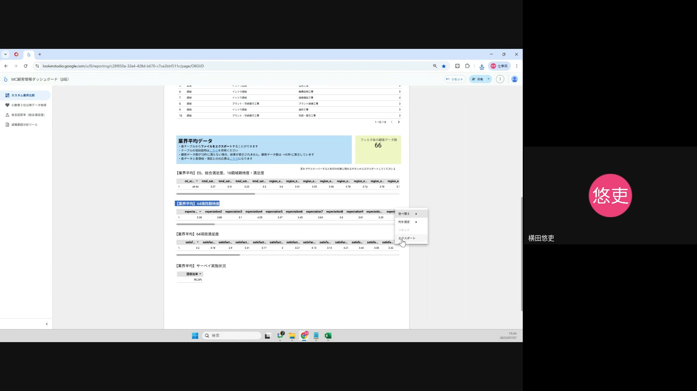

---

## 操作手順 1: 業界比較データのダウンロード

### 1-6. 業界平均64項目（期待度）のダウンロード（続き）

3.  **既存ファイル名削除**: エクスポートダイアログが表示されたら、既存のファイル名を一度削除します。
4.  **ファイル名ペースト**: 先ほどコピーしたファイル名を貼り付けます。
5.  **形式選択**: 「CSV（カンマ区切り）」を選択し、「エクスポート」ボタンをクリックしてダウンロードします。

---

## 操作手順 1: 業界比較データのダウンロード

### 1-7. 業界平均64項目（満足度）のダウンロード

1.  **ファイル名コピー**: 「業界平均64項目：満足度データ」のファイル名をコピーします。
2.  **エクスポートボタンクリック**: ファイル名の右側にある「︙」ボタンをクリックし、表示されるメニューから「データをエクスポート」を選択します。

---

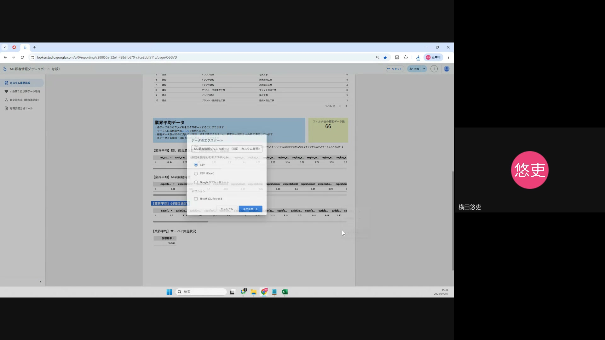

---

## 操作手順 1: 業界比較データのダウンロード

### 1-7. 業界平均64項目（満足度）のダウンロード（続き）

3.  **既存ファイル名削除**: エクスポートダイアログが表示されたら、既存のファイル名を一度削除します。
4.  **ファイル名ペースト**: 先ほどコピーしたファイル名を貼り付けます。
5.  **形式選択**: 「CSV（カンマ区切り）」を選択し、「エクスポート」ボタンをクリックしてダウンロードします。

---

## 操作手順 2: ファイルの取り込み

### 2-1. ファイル取り込みボタンのクリック

Googleスプレッドシートの「設定シート」に戻り、「Step2. ファイル取り込み」セクションにある「一括取り込みボタン」をクリックします。このボタンをクリックすることで、ダウンロードしたデータをスプレッドシートにインポートするためのウィンドウが開きます。

---

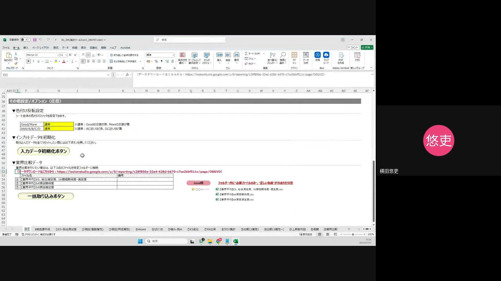

---

## 操作手順 2: ファイルの取り込み

### 2-2. 分析対象企業データの取り込み

まず最初に、分析対象企業データを取り込みます。
1.  **ファイル選択**: 開かれたファイル選択ダイアログで、事前に用意されている分析対象企業データ（ESデータなど）のファイルを選択します。
2.  **「開く」をクリック**: 選択後、「開く」ボタンをクリックします。

---

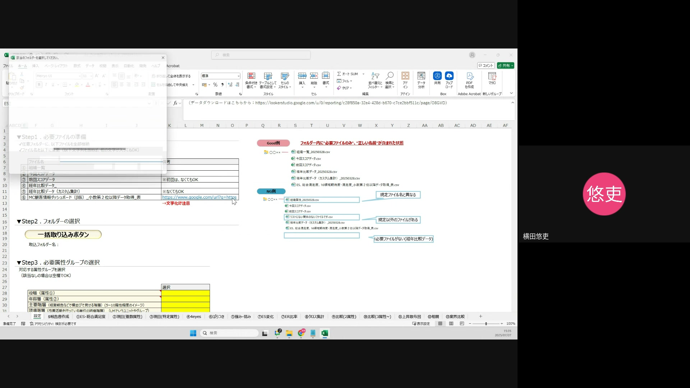

---

## 操作手順 2: ファイルの取り込み

### 2-2. 分析対象企業データの取り込み（続き）

3.  **読み込み完了を待つ**: データが正常に読み込まれるまでしばらく待ちます。読み込みが完了すると、「読み込みが完了しました」というメッセージが表示されます。

**注意点**: 必ず分析対象企業のデータを先に読み込んでください。これにより、後から読み込む業界比較データが正しく紐付けられます。

---

## 操作手順 2: ファイルの取り込み

### 2-3. 業界平均ES（総合満足度・16領域期待度・満足度）の取り込み

次に、ダウンロードした業界平均ESデータを取り込みます。
1.  **ファイル名入力**: ファイル取り込みダイアログに、先ほどダウンロードした「業界平均ES：総合満足度・16領域期待度・満足度データ」のファイル名を正確に入力します。
2.  **「OK」をクリック**: 入力後、「OK」ボタンをクリックします。

---

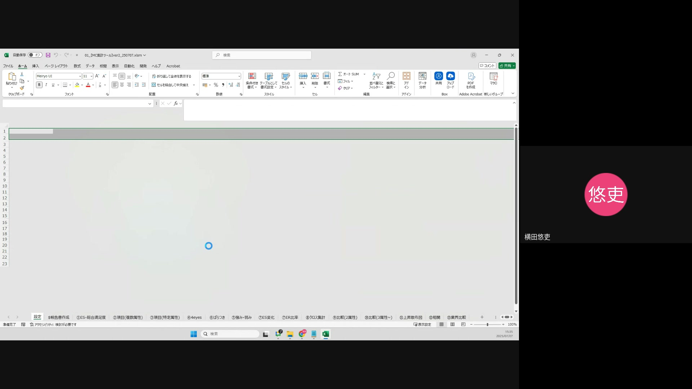

---

## 操作手順 2: ファイルの取り込み

### 2-3. 業界平均ES（総合満足度・16領域期待度・満足度）の取り込み（続き）

3.  **ファイル選択**: 開かれたファイル選択ダイアログで、ダウンロードした「業界平均ES：総合満足度・16領域期待度・満足度データ」のCSVファイルを選択し、「開く」をクリックします。
4.  **読み込み完了を待つ**: データが正常に読み込まれるまでしばらく待ちます。

---

## 操作手順 2: ファイルの取り込み

### 2-4. 業界平均64項目（期待度）の取り込み

続けて、業界平均64項目（期待度）データを取り込みます。
1.  **ファイル名入力**: ファイル取り込みダイアログに、ダウンロードした「業界平均64項目：期待度データ」のファイル名を正確に入力します。
2.  **「OK」をクリック**: 入力後、「OK」ボタンをクリックします。

---

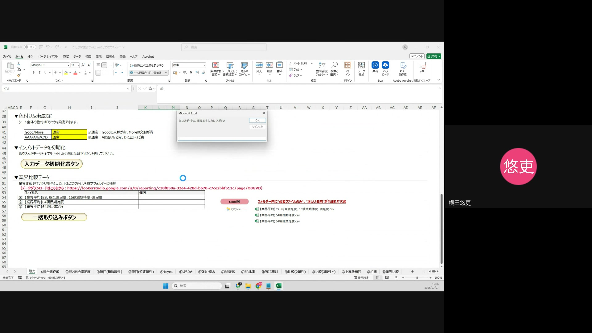

---

## 操作手順 2: ファイルの取り込み

### 2-4. 業界平均64項目（期待度）の取り込み（続き）

3.  **ファイル選択**: 開かれたファイル選択ダイアログで、ダウンロードした「業界平均64項目：期待度データ」のCSVファイルを選択し、「開く」をクリックします。
4.  **読み込み完了を待つ**: データが正常に読み込まれるまでしばらく待ちます。

---

## 操作手順 2: ファイルの取り込み

### 2-5. 業界平均64項目（満足度）の取り込み

最後に、業界平均64項目（満足度）データを取り込みます。
1.  **ファイル名入力**: ファイル取り込みダイアログに、ダウンロードした「業界平均64項目：満足度データ」のファイル名を正確に入力します。
2.  **「OK」をクリック**: 入力後、「OK」ボタンをクリックします。

---

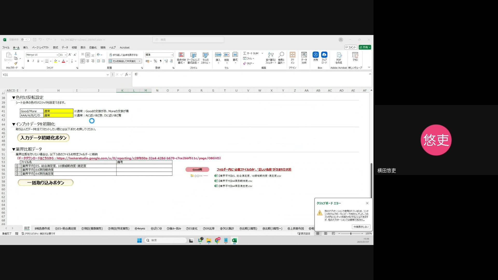

---

## 操作手順 2: ファイルの取り込み

### 2-5. 業界平均64項目（満足度）の取り込み（続き）

3.  **ファイル選択**: 開かれたファイル選択ダイアログで、ダウンロードした「業界平均64項目：満足度データ」のCSVファイルを選択し、「開く」をクリックします。
4.  **読み込み完了を待つ**: データが正常に読み込まれるまでしばらく待ちます。読み込みが完了すると、「読み込みが完了しました」というメッセージが表示されます。

---

## 操作手順 3: 業界比較分析の実施

### 3-1. 業界比較シートへの移動

すべてのデータを取り込んだら、Googleスプレッドシートの画面下部にあるシートタブから「13. 業界比較」シートをクリックして開きます。このシートで、実際の比較分析結果を確認できます。

---

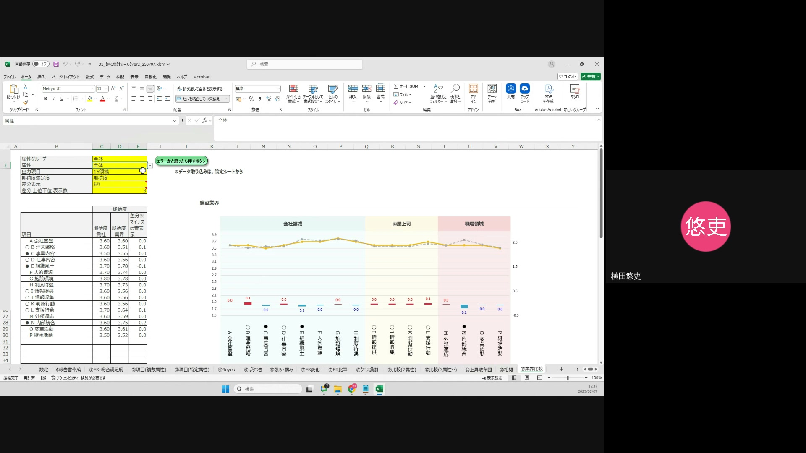

---

## 操作手順 3: 業界比較分析の実施

### 3-2. 属性グループの選択

「業界比較」シートの左側にある「属性グループ」のドロップダウンメニューから、比較したい属性グループを選択します。例えば、「全社員」や特定の部署など、分析の目的に応じて選択してください。この選択により、表示されるデータの絞り込みが行われます。

---

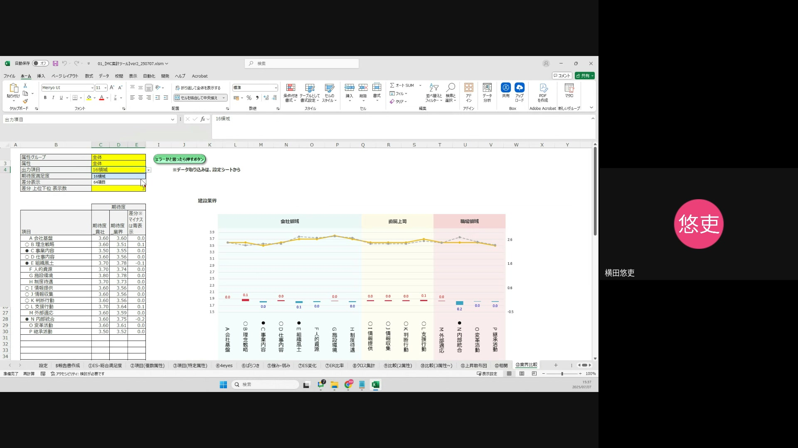

---

## 操作手順 3: 業界比較分析の実施

### 3-3. 比較属性の選択

「属性」のドロップダウンメニューから、実際に比較したい属性を選択します。今回は、全体的な比較を行うため、「全体」を選択します。これにより、選択した属性グループ内の全体データが比較対象となります。

---

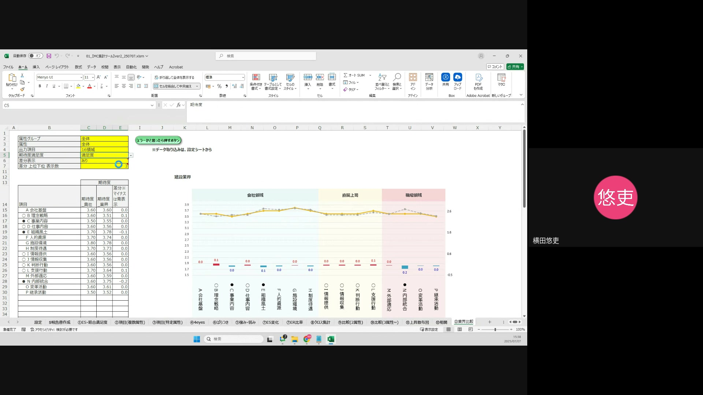

---

## 操作手順 3: 業界比較分析の実施

### 3-4. 出力項目の選択

「出力項目」のドロップダウンメニューから、比較したい項目の粒度を選択します。
* **16領域**: ESの主要な16の領域に絞って比較したい場合に選択します。
* **64項目**: より詳細な64の項目で比較したい場合に選択します。

分析の深さに応じて適切な方を選択してください。

---

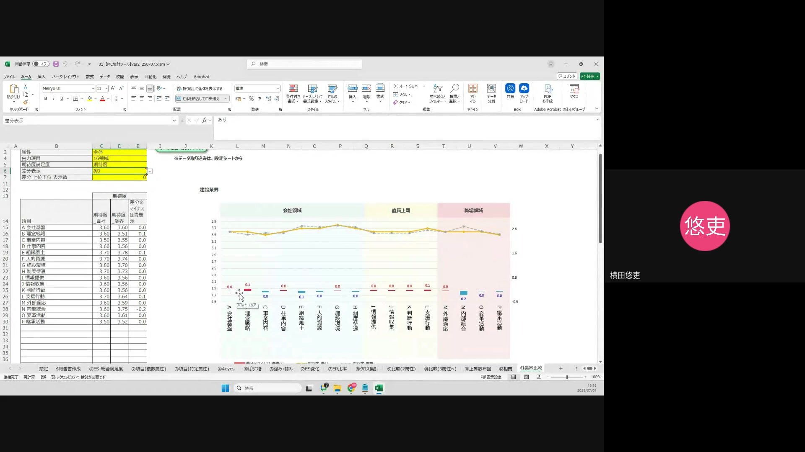

---

## 操作手順 3: 業界比較分析の実施

### 3-5. 比較指標の選択（期待度・満足度）

「期待度/満足度」のドロップダウンメニューから、比較したい指標を選択します。
* **期待度**: 従業員が企業に期待している度合いを比較します。
* **満足度**: 従業員が現在の状況に満足している度合いを比較します。
* **期待度/満足度**: 期待度と満足度の両方を比較し、より包括的な分析を行います。

分析の目的に合わせて選択してください。

---

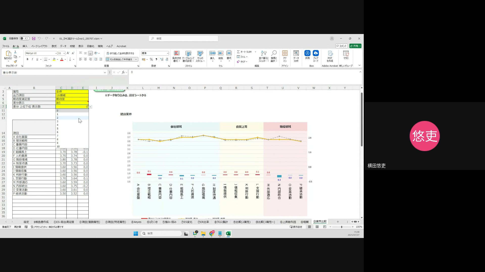

---

## 操作手順 3: 業界比較分析の実施

### 3-6. 差分表示の選択

「差分表示」のドロップダウンメニューから、「表示する」または「表示しない」を選択します。
* **表示する**: 分析対象企業と業界平均との差分が色で表示されます。プラス（自社の方が良い）は赤色、マイナス（業界平均の方が良い）は青色で表示され、視覚的に優位性を把握できます。
* **表示しない**: 差分は表示されず、数値のみが表示されます。

---

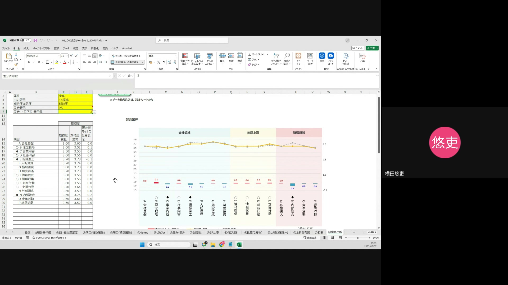

---

## 操作手順 3: 業界比較分析の実施

### 3-7. 差分上位/下位表示数の設定

「差分上位/下位表示数」のドロップダウンメニューから、差分の大きい項目や小さい項目をいくつ表示するかを選択します。例えば「5」を選択すると、差分が最も大きい（良い）項目から5つ、または最も小さい（悪い）項目から5つが表示されます。これにより、特に注目すべき項目に絞って分析を行うことができます。

---

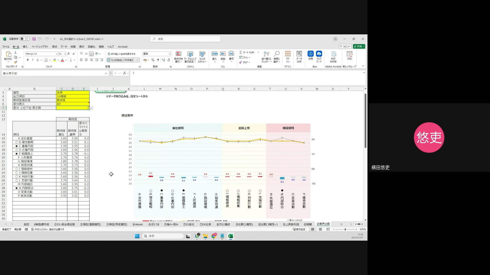

---

## 操作手順 3: 業界比較分析の実施

### 3-8. 分析結果の確認

上記の選択が完了すると、自動的にデータが更新され、設定した条件に基づいた業界比較結果がシートに表示されます。この結果を参考に、自社のES状況を客観的に評価し、改善点や強みを特定してください。

ご不明な点がございましたら、お気軽に担当者までお問い合わせください。 
